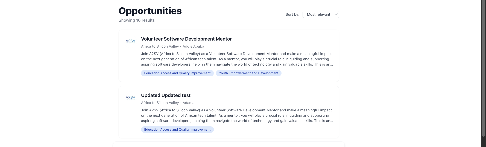
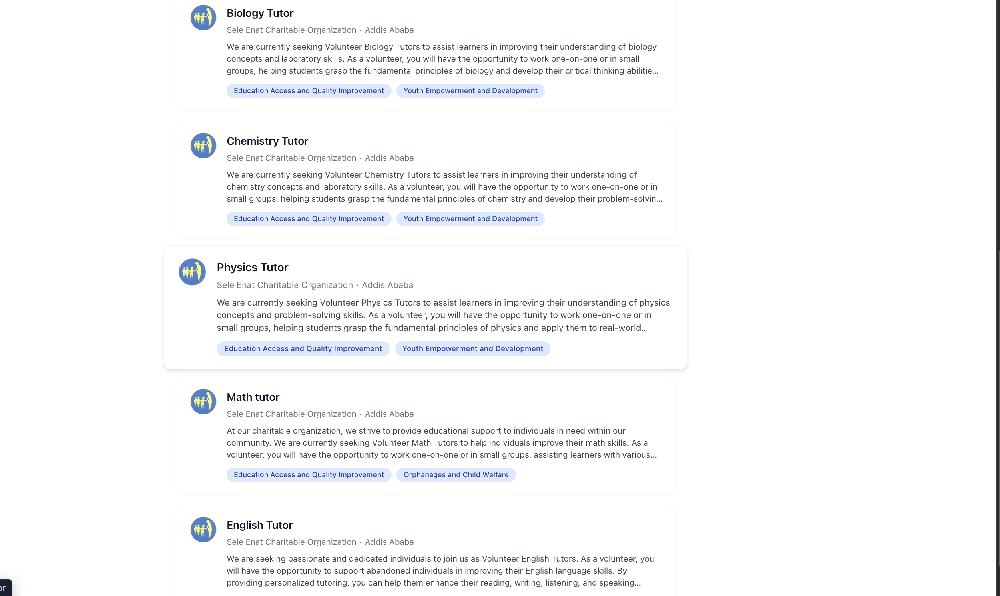
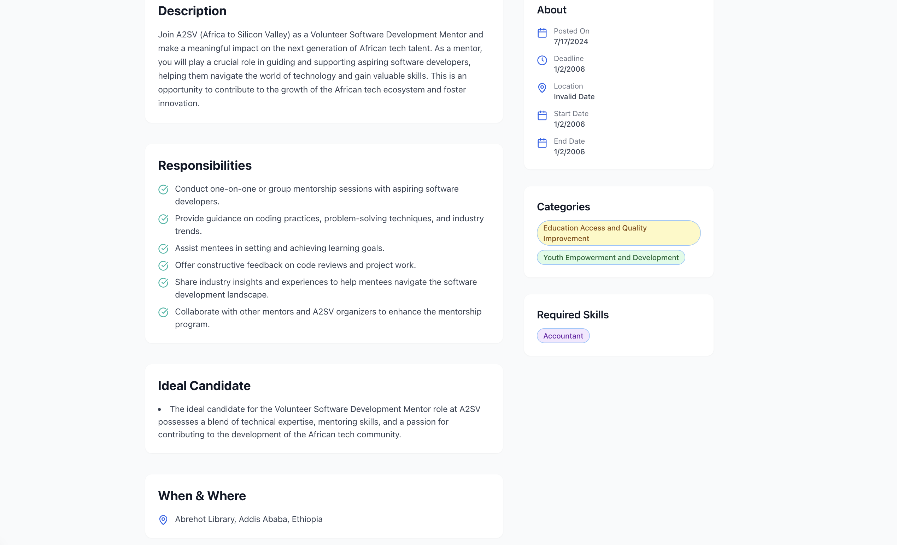

💼 A2SV Integrating-API-Data-into-the-Application – Task 7
This is a simple job opportunity website That displays a list of job opportunities, and users can view detailed information about each job. The project uses Redux Toolkit for efficient state management and data fetching.

🚀 Features
🔍 View all job opportunities

📄 View job details by ID

🖼️ Screenshots
🏠 Landing Page

📋 Job Details Page

⚙️ Technologies Used
Next.js – React-based framework for server-side rendering and routing

Tailwind CSS –  CSS framework for styling

Redux Toolkit – Simplified Redux state management and API integration

📂 Functionalities Overview
Fetch all job listings

